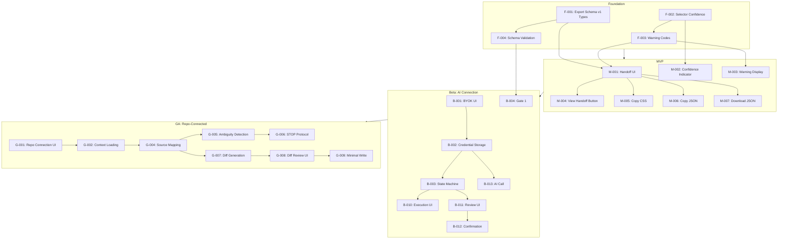

# Visual UI Inspector — Phase 6: Implementation Plan

---

## System Breakdown

### 1. Content Script (`src/content/`)

**Responsibility:**

- DOM interaction: picker mode, hover highlighting, element selection
- Element metadata extraction with hierarchy
- Style patch application with undo/redo
- Selector generation and resolution
- Identity token computation for patch verification
- Stability signal computation at export time

**Must NOT:**

- Make AI calls
- Store AI credentials
- Access repository/filesystem
- Render UI beyond overlays
- Make network requests

---

### 2. Side Panel UI (`src/sidepanel/`)

**Responsibility:**

- Render all user-facing UI states (Empty, Inspecting, Editing, Handoff)
- Display property controls grouped by category
- Show change log and undo/redo controls
- Render Handoff view with CSS diff, JSON export, and stability warnings
- Display AI connection status and execution states (when AI layer exists)
- Gate user actions based on application state

**Must NOT:**

- Directly manipulate the DOM of the inspected page
- Store credentials (delegates to Background)
- Execute AI calls directly (delegates to Background)
- Access repository context directly

---

### 3. Background / Service Worker (`src/background/`)

**Responsibility:**

- Message routing between content script, side panel, and external services
- AI credential storage in `chrome.storage.local`
- AI call execution and response handling
- State machine enforcement for AI execution lifecycle
- Safe-Run Gate validation before AI calls
- Session management across tabs

**Must NOT:**

- Render any UI
- Directly access page DOM
- Store credentials in plain text or localStorage
- Make AI calls without explicit user action
- Auto-retry failed AI calls

---

### 4. Data Layer (`src/shared/`)

**Responsibility:**

- Define canonical types: `FinalPatch`, `Export Schema v1`, `StabilitySignals`
- Provide export generation utilities conforming to Phase 2 contract
- Validate exports against schema before AI consumption
- Compute selector confidence (high/medium/low)
- Generate warning codes (`SELECTOR_POSITIONAL`, `MULTIPLE_ELEMENTS_MATCHED`, etc.)

**Must NOT:**

- Contain UI logic
- Make network calls
- Store runtime state

---

### 5. Prompt Engine Layer (`src/shared/promptTemplate.ts`)

**Responsibility:**

- Generate AI system prompt with guardrails (Phase 3 contract)
- Assemble input payloads in fixed injection order
- Enforce mode declaration (`universal` vs `repo-connected`)
- Validate input completeness before prompt assembly
- Format output contract expectations

**Must NOT:**

- Execute AI calls
- Parse AI responses
- Store session state

---

### 6. AI Connection Layer (new: `src/ai/`)

**Responsibility:**

- Implement BYOK credential entry and storage
- Manage connection lifecycle (DISCONNECTED → CONNECTED_IDLE → etc.)
- Enforce Safe-Run Gates (6 gates from Phase 4)
- Execute AI calls with abort capability
- Validate AI response structure against Output Contract
- Surface refusals as valid output

**Must NOT:**

- Render UI (exposes API to Side Panel)
- Bypass gate checks
- Auto-apply AI output
- Make background calls without user action

---

### 7. Documentation / Spec Sync (`docs/`)

**Responsibility:**

- Maintain phase documents as canonical source of truth
- Track contract versions (currently v1.0.0)
- Document breaking changes with migration notes

**Must NOT:**

- Contain implementation code
- Diverge from implemented behavior without versioning

---

## Milestones

### MVP (Milestone 1)

**Scope Included:**

- Complete UX flow: Empty → Inspecting → Editing → Handoff (Phase 1)
- Export Schema v1 compliance with all required fields (Phase 2)
- Stability signals and warning codes fully computed and displayed
- Handoff State with CSS diff, JSON export, copy-to-clipboard
- Selector confidence indicator (green/yellow/red)
- All warning types surfaced in Handoff UI
- Undo/Redo for all visual changes

**Scope Excluded:**

- AI connection (no BYOK, no AI calls)
- Repo-Connected Mode
- Source mapping
- Direct file modification

**Why Safe to Ship:**

- Delivers complete value without AI: Pick → Edit → Handoff
- All outputs are neutral, framework-agnostic specifications
- User owns responsibility for implementation (trust handoff complete)
- No destructive operations possible

---

### Beta (Milestone 2)

**Scope Included:**

- AI Connection with BYOK credential management (Phase 4)
- Full AI state machine (8 states)
- Safe-Run Gates enforcement (6 gates)
- Universal Handoff Mode with AI-generated implementation guidance
- User Confirmation Contract before AI output is "confirmed"
- Explicit refusal handling and display
- Failure and abort handling with clear messaging

**Scope Excluded:**

- Repo-Connected Mode
- Source mapping
- Direct file writes
- Build/runtime verification

**Why Safe to Ship:**

- AI is advisory only (produces guidance, not actions)
- All gates prevent unsafe execution
- User confirmation required for every AI output
- No file system access
- Clear responsibility boundary: AI suggests, user implements

---

### GA (Milestone 3)

**Scope Included:**

- Repo-Connected Mode with explicit connection flow (Phase 5)
- Source mapping via allowed signals (unique class, data-attribute, source map)
- Ambiguity detection with STOP protocol
- Diff generation and user review before apply
- Minimal write with formatting preservation
- Verification (best-effort): build check, runtime computed style comparison
- All 12 Hard Stop conditions enforced

**Scope Excluded:**

- Multi-file refactoring
- Design system abstraction introduction
- Automatic scope expansion
- Non-CSS changes (event handlers, data attributes)

**Why Safe to Ship:**

- Every code change requires separate confirmation
- Ambiguity always stops, never guesses
- Hard stops prevent all unsafe modifications
- Verification reports honest outcomes (verified/not verified/failed)
- User retains final authority

---

## Execution Backlog

### Foundation Tasks

| Task ID | Description | Depends On | Output | Phase Reference |

|---------|-------------|------------|--------|-----------------|

| `F-001` | Align `PromptHandoffExport` type to Export Schema v1 exactly | — | Updated `types.ts` with `exportVersion`, `capturedAt`, `pageUrl`, `viewport`, `patches[]`, `warnings[]` | Phase 2 |

| `F-002` | Implement selector confidence computation (high/medium/low) | — | Function in `selector.ts` that returns confidence based on ID, class, positional selectors | Phase 2 |

| `F-003` | Implement warning code generation (6 codes) | F-002 | Functions in `handoff.ts` that produce warning objects with `code`, `message`, `affectedSelectors` | Phase 2 |

| `F-004` | Add JSON schema validation for Export Schema v1 | F-001 | Validation function that returns true/false with error list | Phase 2 |

### MVP Tasks

| Task ID | Description | Depends On | Output | Phase Reference |

|---------|-------------|------------|--------|-----------------|

| `M-001` | Build Handoff State UI component | F-001, F-003 | React component showing CSS diff, JSON export, warnings | Phase 1 |

| `M-002` | Add selector confidence indicator to Inspecting State | F-002 | Visual indicator (green/yellow/red dot) in element summary | Phase 1 |

| `M-003` | Implement warning display in Handoff UI (non-dismissable) | F-003 | Inline warning components with proper severity styling | Phase 1, Phase 2 |

| `M-004` | Add "View Handoff" entry point (visible only when `patches.length > 0`) | M-001 | Button in Editing State that transitions to Handoff | Phase 1 |

| `M-005` | Implement copy CSS to clipboard | M-001 | Button action with success toast | Phase 1 |

| `M-006` | Implement copy JSON to clipboard | M-001 | Button action with success toast | Phase 1 |

| `M-007` | Implement download JSON as file | M-001 | Button action that triggers file download | Phase 1 |

| `M-008` | Add original value hints in Editing State | — | Display original computed value next to each modified property | Phase 1 |

| `M-009` | Implement change counter badge | — | Persistent indicator showing count of modified properties | Phase 1 |

| `M-010` | Add "Reset all changes" action for current element | — | Button that reverts all patches for selected element | Phase 1 |

### Beta Tasks (AI Connection)

| Task ID | Description | Depends On | Output | Phase Reference |

|---------|-------------|------------|--------|-----------------|

| `B-001` | Create AI settings UI for BYOK credential entry | — | Settings panel with masked input, save to `chrome.storage.local` | Phase 4 |

| `B-002` | Implement credential storage in service worker | B-001 | Functions: `saveCredentials`, `getCredentials`, `clearCredentials` | Phase 4 |

| `B-003` | Implement AI connection state machine (8 states) | B-002 | State manager with transitions: DISCONNECTED, CONNECTED_IDLE, READY, GENERATING, REVIEW_REQUIRED, CONFIRMED, ABORTED, FAILED | Phase 4 |

| `B-004` | Implement Gate 1: Export Schema Validation | F-004 | Gate check function that blocks on invalid schema | Phase 4 |

| `B-005` | Implement Gate 2: Patches Exist | — | Gate check that blocks when `patches.length === 0` | Phase 4 |

| `B-006` | Implement Gate 3: Stability Acknowledgment | — | Gate check requiring user ack if low confidence or positional warnings | Phase 4 |

| `B-007` | Implement Gate 4: Mode Compatibility | — | Gate check that repo-connected requires repo context | Phase 4 |

| `B-008` | Implement Gate 5: Credentials Valid | B-002 | Gate check for credential existence and validity | Phase 4 |

| `B-009` | Implement Gate 6: No Concurrent Execution | B-003 | Gate check blocking if already in GENERATING state | Phase 4 |

| `B-010` | Build AI execution UI (loading, abort button) | B-003 | UI for GENERATING state with progress and abort | Phase 4 |

| `B-011` | Build AI output review UI | B-003 | UI for REVIEW_REQUIRED state with full output display | Phase 4 |

| `B-012` | Implement User Confirmation flow | B-011 | Explicit "I Understand & Confirm" button, positioned after output | Phase 4 |

| `B-013` | Implement AI call execution with abort | B-003, B-008 | Function that calls AI API, supports cancellation | Phase 4 |

| `B-014` | Implement AI response validation against Output Contract | B-013 | Validator for required sections: Summary, Implementation Guidance, Selectors, Warnings, Verification | Phase 3 |

| `B-015` | Implement refusal display | B-014 | UI that shows refusal reason and resolution, disables downstream actions | Phase 3 |

| `B-016` | Implement failure/abort handling with messaging | B-003 | Clear error messages for all failure scenarios, recovery paths | Phase 4 |

| `B-017` | Inject System Prompt (guardrails) into all AI calls | — | Non-editable prompt prepended per Phase 3 contract | Phase 3 |

| `B-018` | Implement prompt assembly with fixed injection order | B-017, F-001 | Function assembling: System Prompt → Mode → Export → User Notes | Phase 3 |

### GA Tasks (Repo-Connected)

| Task ID | Description | Depends On | Output | Phase Reference |

|---------|-------------|------------|--------|-----------------|

| `G-001` | Build repository connection UI | — | Settings flow for explicit repo connection | Phase 5 |

| `G-002` | Implement repo context loading and validation | G-001 | Functions to load file paths, validate access | Phase 5 |

| `G-003` | Set mode flag based on preconditions | G-002 | Logic that sets `mode: "repo-connected"` only when all 4 preconditions met | Phase 5 |

| `G-004` | Implement source mapping via allowed signals | G-002 | Mapper using unique class, data-attribute, source map, file naming | Phase 5 |

| `G-005` | Implement ambiguity detection | G-004 | Detector for multiple sources, dynamic generation, shared styling, inheritance | Phase 5 |

| `G-006` | Implement STOP protocol on ambiguity | G-005 | Stop, report, list candidates, recommend next step | Phase 5 |

| `G-007` | Implement diff generation (pre-apply proposal) | G-004 | Exact line-level diff: file path, original lines, modified lines | Phase 5 |

| `G-008` | Build diff review UI | G-007 | UI showing diff, requiring explicit Apply confirmation | Phase 5 |

| `G-009` | Implement minimal write with formatting preservation | G-008 | File write that modifies only diff lines, preserves style | Phase 5 |

| `G-010` | Implement Hard Stop: Source Mapping (3 conditions) | G-004 | Blocks on: can't map, multiple definitions, dynamic generation | Phase 5 |

| `G-011` | Implement Hard Stop: Scope Violation (3 conditions) | — | Blocks on: design intent ambiguity, multiple elements affected, refactoring required | Phase 5 |

| `G-012` | Implement Hard Stop: Data Quality (3 conditions) | — | Blocks on: low confidence, multiple elements matched, element not found | Phase 5 |

| `G-013` | Implement Hard Stop: System Integrity (3 conditions) | — | Blocks on: unknown styling system, confirmation bypass, scope expansion | Phase 5 |

| `G-014` | Implement verification: build check (if available) | G-009 | Run build, report success/failure | Phase 5 |

| `G-015` | Implement verification: runtime computed style check | G-009, G-014 | Reload, query element, compare computed styles to FinalPatch | Phase 5 |

| `G-016` | Implement verification outcome reporting | G-014, G-015 | Report: Verified, Partially Verified, Not Verified, Verification Failed | Phase 5 |

---

## Definition of Done (Global)

Every task is complete when ALL of the following are true:

1. **Contract Compliance**: Implementation matches the referenced phase document verbatim. No reinterpretation, no "improvements."

2. **UX Clarity**: User understands what is happening at every moment. No ambiguous states. Labels are precise.

3. **Failure Visibility**: All errors produce visible, human-readable messages. No silent failures. No swallowed exceptions.

4. **No Silent Success**: Success states are explicitly communicated. Completion is confirmed, not assumed.

5. **Documentation Update**: If behavior changes from spec, the spec is versioned and updated. Code and docs stay in sync.

6. **Trust Preserved**: No action bypasses user confirmation. No data leaves the browser without user action. Credentials are never logged or displayed in full.

7. **State Consistency**: System can never be in two states simultaneously. State transitions are deterministic and logged.

---

## Risk Register

| Risk | Threatens | Mitigation |

|------|-----------|------------|

| **AI provider rate limits or outages** | Beta (AI execution) | Implement clear error messaging for 429/5xx responses. No auto-retry. User decides when to retry. |

| **Selector instability across page changes** | MVP (Handoff reliability) | Compute and display confidence signals prominently. Surface warnings non-dismissably. Educate user on adding stable identifiers. |

| **Source mapping fails for CSS-in-JS/dynamic styles** | GA (Repo-Connected) | Hard Stop on dynamic generation detection. STOP protocol with candidate list. Never guess. |

| **User stores invalid credentials** | Beta (AI connection) | Validate credentials on first use. Mark as invalid on 401. Require re-entry. No auto-clear to preserve user awareness. |

| **Multiple browser tabs cause state confusion** | All phases | Scope all state to tab ID. Service worker routes messages by sender tab. Clear state on tab close. |

| **Export schema changes break AI consumers** | All phases post-MVP | Version exports. Check `exportVersion` before parsing. Require migration notes for any schema change. |

| **Concurrent AI requests create race conditions** | Beta (AI execution) | Gate 6 (No Concurrent Execution) strictly enforced. UI disables initiation during GENERATING. |

| **Large DOM causes performance issues** | MVP (Picker mode) | Limit class list extraction to 5 classes. Truncate text previews to 60 chars. Debounce hover events. |

| **Repo write fails mid-operation** | GA (Repo-Connected) | Atomic write: all-or-nothing. On failure, preserve original file. Report failure clearly. |

| **User expects AI to auto-apply changes** | Beta (UX clarity) | Empty State messaging emphasizes manual flow. AI output UI clearly labels as "guidance." Confirmation language transfers responsibility. |

| **Iframe and CORS restrictions block inspection** | MVP (Content script) | Detect and surface "Cannot inspect this element" message. Do not attempt to bypass security. |

| **Extension permissions rejected by user** | All phases | Graceful degradation messaging. Clear explanation of why permission is needed. No silent failure. |

---

## Dependency Graph

---

## Implementation Order Summary

1. **Foundation (F-001 to F-004)**: Data types and validation — required by everything
2. **MVP (M-001 to M-010)**: Complete Pick → Edit → Handoff without AI
3. **Beta (B-001 to B-018)**: Add AI connection and Universal Mode
4. **GA (G-001 to G-016)**: Add Repo-Connected Mode with source mapping

Each milestone is independently shippable and delivers user value.